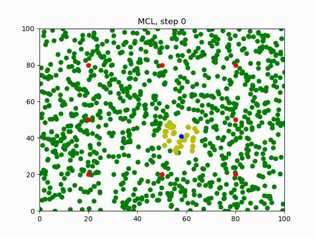
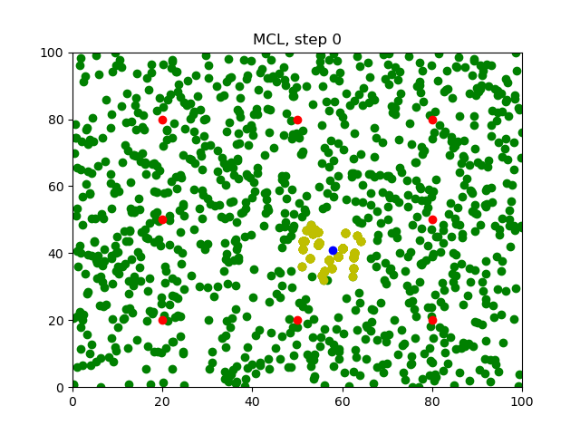
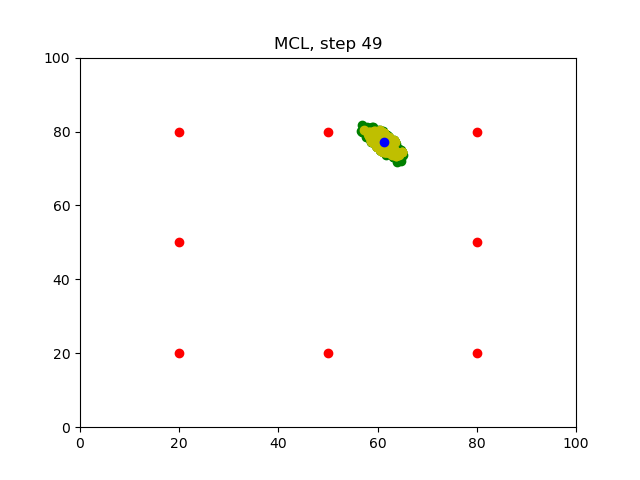

[](https://www.udacity.com/robotics)

# RoboND-MCL-Lab
You will be able to observe the `MCL` (Monte Carlo Localization) in action. 

#### Final outcome


### Operating system

- Linux Ubuntu 20.04 LTS (Focal)

### Dependencies

- g++
- cmake-v3.19
- python3.8-dev
- python3-numpy
- python3-matplotlib
- ffmpeg

### Compiling the Program
```sh
$ cd <repo root>
$ mkdir build && cd build
$ cmake ..
$ make
```

### Running the Program

Before you run the program, make sure the `Images` folder is empty!

```sh
$ cd <repo root>/bin
$ ./main
```
Wait for the program to iterate `50` times.

### Generating the Images

After running the program, `50` images will be generated in the `Images` folder.

#### Step0

#### Step49


### Generating the Gif

```sh
$ cd <repo root>/Images
$ ffmpeg -f image2 -framerate 1 -i Step%d.png video.avi
$ ffmpeg -i video.avi output.gif
```